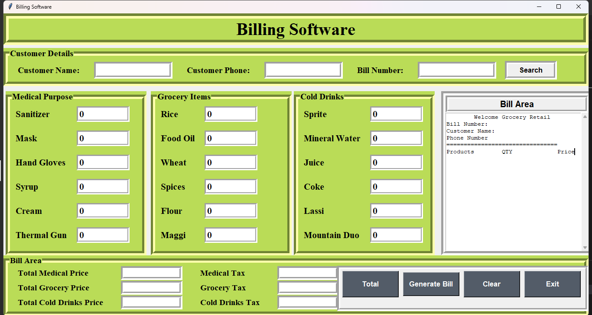

# 🧾 Billing System in Python (Tkinter)

A desktop-based Billing System developed using Python and Tkinter. A simple yet powerful desktop-based Billing Software built using **Python and Tkinter GUI library**. This application allows users to select items, specify quantities, and generate an itemized bill with price, tax, and total calculations. It is designed for small retail businesses to streamline their billing process.

---

## 🔧 Technologies Used

- **Python 3.x**
- **Tkinter** (for GUI)
- **OS module** (for saving bills)
- **Datetime module** (for timestamped billing)

---

## ✨ Features

- 🧺 Item Selection with predefined categories (e.g., Grocery, Beverages, Snacks)
- 🔢 Quantity Input for each item
- 💰 Automatic calculation of:
  - Item-wise total
  - Tax
  - Grand Total
- 🧾 Bill Preview and Save option
- 📂 Previous Bill Search by Bill Number
- ♻️ Reset Button to clear all fields

---

## 🖥️ UI Overview

| Feature | Description |
|--------|-------------|
| **Product Entry** | Select and enter quantity for items |
| **Bill Area** | Shows real-time calculated bill |
| **Buttons** | Total, Generate Bill, Save, Search, Reset, Exit |
| **Customer Details** | Name, Phone Number, Bill Number |

---

## 📸 Screenshots

 <br>
*Main billing interface with categorized items and live total preview.*

---

## 🚀 Getting Started

### Prerequisites

- Python 3.x installed on your machine

### Run the application

```bash
python billingSystem.py
